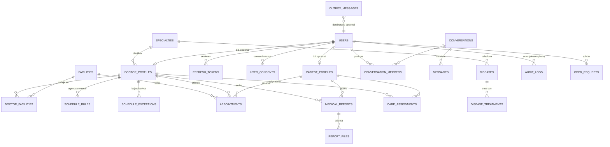

# VitSync v2 — Guía de construcción desde cero (nivel empresa)

> Documento de arranque para rehacer VitSync (VITSYNC-API + VITSYNC-WebApp) partiendo
> de cero, con el proceso que sigue un equipo profesional: primero contrato y datos,
> después código, y en todo momento pruebas, CI y documentación.
> Fecha: 2026-08-13 · Autor: Carlos · Objetivo: portfolio de nivel senior-junior alto.

---

## Índice

- [Parte A — Análisis del proyecto actual](#parte-a--análisis-del-proyecto-actual)
- [Parte B — Stack v2 y decisiones](#parte-b--stack-v2-y-decisiones)
- [Fase 0 — Kickoff: alcance, ADRs, repos y convenciones](#fase-0--kickoff-alcance-adrs-repos-y-convenciones)
- [Fase 1 — Modelo de dominio y base de datos](#fase-1--modelo-de-dominio-y-base-de-datos)
- [Fase 2 — Entorno local reproducible + migraciones](#fase-2--entorno-local-reproducible--migraciones)
- [Fase 3 — Contrato de API primero (OpenAPI)](#fase-3--contrato-de-api-primero-openapi)
- [Fase 4 — Esqueleto del backend](#fase-4--esqueleto-del-backend)
- [Fase 5 — Primera vertical slice completa](#fase-5--primera-vertical-slice-completa)
- [Fase 6 — Seguridad y cumplimiento](#fase-6--seguridad-y-cumplimiento)
- [Fase 7 — Ficheros y almacenamiento](#fase-7--ficheros-y-almacenamiento)
- [Fase 8 — Tiempo real (chat/notificaciones)](#fase-8--tiempo-real-chatnotificaciones)
- [Fase 9 — Frontend React desde cero](#fase-9--frontend-react-desde-cero)
- [Fase 10 — Estrategia de pruebas](#fase-10--estrategia-de-pruebas)
- [Fase 11 — CI/CD, entornos y observabilidad](#fase-11--cicd-entornos-y-observabilidad)
- [Fase 12 — Documentación y presentación del portfolio](#fase-12--documentación-y-presentación-del-portfolio)
- [Roadmap por sprints](#roadmap-por-sprints)
- [Anexos](#anexos)

---

# Parte A — Análisis del proyecto actual

## A.1 Lo que hay hoy

**VITSYNC-API** — Spring Boot 3.2.5 / Java 21 / Maven / PostgreSQL (Neon) / Spring Security 6
con JWT RS256 + refresh opaco en BD, WebSocket STOMP, Resend para email, Bucket4j
(rate limit), Apache Tika (MIME), JaCoCo con umbral 80% en `service` y `util`, H2 en tests.

Paquetes: `controller · service · repository · model · dto · config(+ratelimit) · converter ·
audit · enums · exception · util · validation` → **arquitectura por capas (package-by-layer)**.

Entidades: `User` (herencia JPA `JOINED`) → `Paciente`, `Medico`, `Administrador`;
`Cita`, `Especialidad`, `Hospital`, `Informe`, `Mensaje`, `ChatMessage`, `PacienteMedico`,
`RefreshToken`, `AuditLog`, `HistorialAcceso`, `Enfermedad` (+ `enfermedad_tratamientos`).

**VITSYNC-WebApp** — Vue 3.5 + Vite 7 + Tailwind 4, Vue Router, axios con interceptor
`401 → refresh → retry` (single-flight), stores caseros (refs exportados, sin Pinia),
Vitest, TalkJS + STOMP conviviendo, deploy en Vercel.

**Trabajo bien hecho que hay que conservar como criterio** (esto ya es nivel profesional
y es lo que se debe repetir en v2):
- Access token solo en memoria + refresh en cookie `httpOnly` con rotación y hash SHA-256 en BD.
- Cifrado en reposo AES-256-GCM de campos clínicos vía `AttributeConverter`.
- Auditoría append-only con AOP (`@Auditable` → `audit_logs`) y actor pseudonimizable.
- Auditoría de seguridad documentada (V01…V21) con CVSS y mapeo a RGPD / Ley 41/2002.
- Índice único parcial `ux_citas_medico_fechahora_activa` como garantía real anti-doble-reserva.

## A.2 Problemas estructurales a corregir en v2

| # | Problema detectado | Evidencia en el repo | Corrección en v2 |
|---|---|---|---|
| P1 | **Esquema sin herramienta de migración**: `ddl-auto=validate` en prod + scripts SQL manuales que hay que acordarse de ejecutar | `scripts/sql/V2…V9`, nota "ejecutar en Neon ANTES de desplegar" | **Flyway** versionado en el repo, aplicado en el arranque y en CI |
| P2 | **Herencia JPA `JOINED` en `User`** → cada carga polimórfica hace LEFT JOIN a 3 subtablas; provocó médicos huérfanos | `FIX01__backfill_medicos_rows.sql` | Sin herencia JPA: `users` (identidad) + `patient_profiles` / `doctor_profiles` 1:1 |
| P3 | **Entidades serializadas directamente a JSON** con parches `@JsonIgnore`, `@JsonIgnoreProperties`, `@JsonProperty` | `User.java`, `Cita.java`, `Hospital.java` (`@JsonProperty("name")` sobre `nombre`) | DTOs de entrada/salida + **MapStruct**; la entidad nunca cruza el controlador |
| P4 | **Deriva de nombres ES/EN** (`nombre` ↔ `name`, `Cita` ↔ appointment) resuelta con anotaciones | `Hospital.java` | Un solo idioma en código y BD (**inglés**), español solo en la UI y en los textos |
| P5 | **Sin paginación** en listados | V19 de la auditoría | `Page<T>` obligatorio en todo listado; cursor en históricos grandes |
| P6 | **Sin documentación de API viva** (solo `API_REFERENCE.md` a mano) | `docs/API_REFERENCE.md` | **springdoc-openapi** + spec versionada + cliente TS generado |
| P7 | **Tests con H2** mientras producción es PostgreSQL | `pom.xml` scope test | **Testcontainers** con la misma versión de Postgres |
| P8 | Ficheros en **disco efímero** de Render, se pierden en cada deploy | `application.properties` (`UPLOAD_DIR`) | **S3-compatible** (MinIO local / Cloudflare R2 o S3 en cloud) + URLs prefirmadas |
| P9 | **Email síncrono** dentro de la transacción; fallos tragados | `EmailService` (excluido de cobertura) | **Outbox transaccional** + worker asíncrono con reintentos |
| P10 | Dos sistemas de chat conviviendo (TalkJS + STOMP propio) | `docs/ARCHITECTURE.md` | Una sola decisión, escrita en un ADR |
| P11 | Estado del frontend a mano (refs exportados), cacheo y reintentos artesanales | `src/store/*.js` | **TanStack Query** para estado de servidor, Zustand solo para estado de UI |
| P12 | JavaScript sin tipos en el front | todo `src/` | **TypeScript estricto** + tipos generados del OpenAPI |
| P13 | Deuda arrastrada visible en el propio README ("temporales a revertir antes de mergear") | `RESUMEN_PROYECTO.md` §8 | Ninguna rama se mergea con "temporales"; lo impide la CI |

> Cómo contarlo en una entrevista: “v1 fue un proyecto funcional con una auditoría de
> seguridad real; v2 es la reconstrucción aplicando lo aprendido con contrato primero,
> migraciones versionadas y tipos de punta a punta”.

---

# Parte B — Stack v2 y decisiones

| Capa | v1 | **v2** | Motivo |
|---|---|---|---|
| BD | PostgreSQL 15 (Neon) | **PostgreSQL 16** (Neon/Supabase o Docker local) | Se mantiene, como pediste |
| Migraciones | scripts SQL manuales | **Flyway** | Reproducible, versionado, ejecutable en CI |
| Backend | Spring Boot 3.2.5 | **Spring Boot 3.5.x / Java 21 (LTS)** | Se mantiene; versión con soporte |
| Build | Maven | **Maven** (o Gradle si prefieres) | Maven ya lo dominas; no es donde está el valor |
| Mapeo | manual + Lombok `@Data` en entidades | **MapStruct** + Lombok acotado | `@Data` en entidades JPA rompe `equals/hashCode` |
| Docs API | markdown a mano | **springdoc-openapi 2** | Contrato ejecutable |
| Errores | JSON ad-hoc | **RFC 9457 `ProblemDetail`** | Estándar, ya nativo en Spring 6 |
| Tests | JUnit5 + H2 | **JUnit5 + Testcontainers + RestAssured/MockMvc** | Fidelidad con prod |
| Auth | JWT RS256 + refresh en BD | **igual** (+ rotación y familia de tokens) | Ya estaba bien resuelto |
| Ficheros | disco local | **S3 compatible (MinIO/R2)** + presigned URLs | Persistencia real |
| Async | llamadas directas | **Outbox + `@Scheduled` worker** (o RabbitMQ si quieres subir nivel) | Fiabilidad del email |
| Observabilidad | Actuator health | **Actuator + Micrometer + logs JSON + trace id** | Diagnóstico en prod |
| Frontend | Vue 3 + JS | **React 19 + TypeScript + Vite 7** | Lo pediste; y es lo más demandado |
| Rutas front | Vue Router | **React Router 7** (o TanStack Router si quieres rutas tipadas) | Estándar del ecosistema |
| Estado servidor | stores caseros | **TanStack Query v5** | Cache, reintentos, invalidación, estados de carga |
| Estado UI | refs exportados | **Zustand** | Mínimo y suficiente |
| Formularios | manual | **React Hook Form + Zod** | Validación tipada compartida |
| Estilos | Tailwind 4 | **Tailwind 4 + shadcn/ui** | Se mantiene; componentes accesibles listos |
| Cliente HTTP | axios artesanal | **openapi-fetch / orval generado del OpenAPI** | Sin drift entre front y back |
| Tests front | Vitest | **Vitest + Testing Library + MSW + Playwright** | Pirámide completa |
| CI/CD | manual | **GitHub Actions** (build, test, lint, migraciones, imagen Docker) | Requisito de empresa |

**Lo que NO cambia**: PostgreSQL, Spring Boot, Java, el dominio sanitario y el nivel de
exigencia RGPD. Todo lo demás se sustituye por la opción que un equipo elegiría hoy.

---

# Fase 0 — Kickoff: alcance, ADRs, repos y convenciones

**Duración objetivo: 2–3 días. No se escribe código de producto todavía.**

En una empresa esta fase existe siempre; lo que cambia es el nombre (discovery, inception,
sprint 0). Su producto son documentos, no funcionalidades.

### 0.1 Definir el alcance del MVP (y lo que queda fuera)

Escribe `docs/SCOPE.md` con tres listas cerradas:

- **MVP (v2.0)**: registro/login/2FA, catálogo de especialidades y cuadro médico,
  reserva y cancelación de citas, perfil del paciente, informes con descarga,
  panel admin (usuarios, médicos, especialidades), derechos RGPD (acceso, exportación, supresión).
- **Siguiente (v2.1)**: chat, "Mi Salud" con mediciones y gráficas, informes en PDF.
- **Fuera**: facturación, integración HL7/FHIR, app móvil.

Escríbelo como **historias de usuario** con criterios de aceptación en Gherkin:

```gherkin
Funcionalidad: Reserva de cita
  Escenario: El hueco ya no está disponible
    Dado un paciente autenticado
    Y una cita activa del doctor D el 2026-09-01 a las 10:00
    Cuando solicita cita con el doctor D el 2026-09-01 a las 10:00
    Entonces recibe 409 Conflict con code "APPOINTMENT_SLOT_TAKEN"
    Y no se crea ninguna cita nueva
```

### 0.2 ADRs (Architecture Decision Records)

Carpeta `docs/adr/`, un fichero por decisión, plantilla MADR:

```markdown
# ADR-0003: Sin herencia JPA en el modelo de usuario

## Estado
Aceptado — 2026-08-13

## Contexto
En v1, `User` usaba `@Inheritance(JOINED)` con subtipos Paciente/Medico/Administrador.
Cada carga polimórfica hacía LEFT JOIN con tres subtablas, y sembrar médicos solo en
`users` dejó filas huérfanas (ver FIX01__backfill_medicos_rows.sql).

## Decisión
`users` guarda identidad y autenticación. Los datos específicos viven en
`patient_profiles` y `doctor_profiles`, con PK = FK a `users.id` (1:1 opcional).
El rol se resuelve por la columna `role` y por la existencia del perfil.

## Consecuencias
+ Consultas más simples y predecibles, sin joins polimórficos.
+ Un usuario puede tener más de un perfil si algún día hace falta.
− Hay que crear explícitamente el perfil al alta (se hace en un servicio transaccional).
```

ADRs mínimos para arrancar: 0001 stack, 0002 monorepo vs polirepo, 0003 modelo de usuario,
0004 estrategia de autenticación, 0005 cifrado en reposo, 0006 almacenamiento de ficheros,
0007 estrategia de tiempo real, 0008 estrategia de pruebas.

### 0.3 Repositorios y ramas

Dos repos (como ahora) con contrato compartido, o monorepo con `apps/api` y `apps/web`.
**Recomendación**: monorepo `vitsync` con pnpm workspaces para el front y Maven para el back;
te ahorra sincronizar el OpenAPI entre repos y demuestra manejo de tooling.

Ramas: **trunk-based con ramas cortas**.

```
main        ← siempre desplegable, protegida, solo merge por PR verde
feat/VIT-12-appointment-booking
fix/VIT-31-refresh-rotation
chore/VIT-40-bump-spring
```

Reglas de protección de `main`: PR obligatorio, 1 revisión, CI verde, historial lineal
(squash merge), sin force-push.

### 0.4 Convenciones (escritas, no implícitas)

`CONTRIBUTING.md`:
- **Commits**: Conventional Commits (`feat(appointments): add cancel endpoint`).
- **Idioma**: código, tablas, ramas, commits y ADRs en **inglés**; UI y textos de usuario en español.
- **Java**: Google Java Format vía Spotless; `mvn spotless:check` en CI.
- **TypeScript**: ESLint + Prettier, `strict: true`, sin `any` sin comentario justificativo.
- **Definition of Done** (aplícala a cada PR):
  1. Tests unitarios y de integración de la funcionalidad, en verde.
  2. Migración Flyway si toca el esquema.
  3. OpenAPI actualizado (se genera solo si anotas bien).
  4. Sin `TODO` sin issue asociado.
  5. Sin cambios "temporales" (el error de v1).
  6. README/ADR actualizado si cambia una decisión.

### 0.5 Gestión

Un tablero (GitHub Projects) con `Backlog → Ready → In progress → In review → Done`.
Issues con prefijo `VIT-n`, mismo prefijo en ramas y commits. Es gratis y en el portfolio
se ve el rastro de trabajo, que es exactamente lo que mira un revisor técnico.

**Entregables de la fase 0**: `SCOPE.md`, `docs/adr/0001..0008`, `CONTRIBUTING.md`,
repo creado con protección de ramas y tablero con el backlog del MVP.

---

# Fase 1 — Modelo de dominio y base de datos

**Duración objetivo: 3–4 días.** Aquí se gana o se pierde el proyecto: un esquema mal
pensado se paga en cada funcionalidad posterior.

### 1.1 Del lenguaje del negocio al modelo

Glosario en `docs/DOMAIN.md` (término, definición, nombre en código):

| Negocio (ES) | Código/BD (EN) | Definición |
|---|---|---|
| Paciente | `patient_profile` | Usuario que recibe asistencia |
| Médico | `doctor_profile` | Profesional con nº de colegiado y especialidad |
| Cita | `appointment` | Reserva de un hueco con un médico |
| Hueco | `slot` | Intervalo reservable derivado de la agenda |
| Informe | `medical_report` | Documento clínico asociado a un paciente |
| Especialidad | `specialty` | Área médica |
| Centro | `facility` | Hospital o centro |

### 1.2 Reglas de diseño de esquema que aplica una empresa

1. **Claves**: PK interna `bigint GENERATED ALWAYS AS IDENTITY` + `public_id uuid` (UUIDv7)
   para exponer al exterior. Nunca expongas el autoincremental (evita enumeración e IDOR por conteo).
2. **Tiempos**: `timestamptz` siempre, guardado en UTC; en Java `Instant`/`OffsetDateTime`.
   Nunca `timestamp` sin zona para eventos.
3. **Dinero/duración**: `integer` de minutos, no floats.
4. **Enums**: `varchar` + `CHECK` (o tabla de catálogo). Los enums nativos de Postgres son
   incómodos de migrar.
5. **Auditoría de fila**: `created_at`, `updated_at`, `created_by`, `version` (optimistic locking).
6. **Borrado**: `deleted_at` (soft delete) donde la ley obliga a conservar (Ley 41/2002 art. 17:
   documentación clínica ≥ 5 años). Borrado físico solo donde no hay obligación.
7. **Integridad en la BD, no solo en Java**: FKs, `NOT NULL`, `UNIQUE`, `CHECK` y los índices
   únicos parciales (como el de anti-doble-reserva de v1, que fue un acierto).
8. **Índices**: uno por cada patrón de consulta real (FK + campo de filtro + orden).
9. **Datos especiales (Art. 9 RGPD)**: cifrado en reposo con `AttributeConverter`;
   si necesitas buscar por un campo cifrado (p. ej. NIF), añade **blind index**
   (`nif_hash = HMAC-SHA256(nif, pepper)`) con índice único sobre el hash.

### 1.3 Diagrama entidad-relación (v2)



### 1.4 Tablas núcleo (DDL de referencia)

```sql
-- ============ identidad ============
CREATE TABLE users (
    id                 bigint GENERATED ALWAYS AS IDENTITY PRIMARY KEY,
    public_id          uuid        NOT NULL UNIQUE,
    email              citext      NOT NULL UNIQUE,          -- requiere CREATE EXTENSION citext
    password_hash      text        NOT NULL,
    role               varchar(20) NOT NULL
                       CHECK (role IN ('PATIENT','DOCTOR','ADMIN')),
    status             varchar(20) NOT NULL DEFAULT 'PENDING_VERIFICATION'
                       CHECK (status IN ('PENDING_VERIFICATION','ACTIVE','SUSPENDED','DEACTIVATED','ANONYMIZED')),
    first_name         text        NOT NULL,
    last_name          text        NOT NULL,
    -- NIF cifrado + blind index para poder buscarlo sin descifrar toda la tabla
    nif_encrypted      text        NOT NULL,
    nif_hash           char(64)    NOT NULL UNIQUE,
    phone_encrypted    text,
    birth_date         date        NOT NULL,
    locale             varchar(10) NOT NULL DEFAULT 'es-ES',
    email_verified_at  timestamptz,
    two_factor_enabled boolean     NOT NULL DEFAULT false,
    created_at         timestamptz NOT NULL DEFAULT now(),
    updated_at         timestamptz NOT NULL DEFAULT now(),
    deleted_at         timestamptz,
    version            bigint      NOT NULL DEFAULT 0
);
CREATE INDEX idx_users_role_status ON users (role, status) WHERE deleted_at IS NULL;

-- ============ perfiles (sin herencia JPA) ============
CREATE TABLE patient_profiles (
    user_id                bigint PRIMARY KEY REFERENCES users(id) ON DELETE CASCADE,
    health_card_encrypted  text,
    blood_type_encrypted   text,
    allergies_encrypted    text,
    conditions_encrypted   text,
    emergency_contact_encrypted text,
    created_at             timestamptz NOT NULL DEFAULT now(),
    updated_at             timestamptz NOT NULL DEFAULT now(),
    version                bigint NOT NULL DEFAULT 0
);

CREATE TABLE doctor_profiles (
    user_id        bigint PRIMARY KEY REFERENCES users(id) ON DELETE CASCADE,
    license_number varchar(32) NOT NULL UNIQUE,
    specialty_id   bigint REFERENCES specialties(id) ON DELETE SET NULL,
    bio            text,
    photo_key      text,                       -- clave en el bucket S3, no URL
    active         boolean NOT NULL DEFAULT true,
    created_at     timestamptz NOT NULL DEFAULT now(),
    updated_at     timestamptz NOT NULL DEFAULT now(),
    version        bigint NOT NULL DEFAULT 0
);
CREATE INDEX idx_doctor_profiles_specialty ON doctor_profiles (specialty_id) WHERE active;

-- ============ catálogo ============
CREATE TABLE specialties (
    id          bigint GENERATED ALWAYS AS IDENTITY PRIMARY KEY,
    public_id   uuid NOT NULL UNIQUE,
    code        varchar(40)  NOT NULL UNIQUE,
    slug        varchar(80)  NOT NULL UNIQUE,
    name        text         NOT NULL,
    description text,
    kind        varchar(20)  NOT NULL
                CHECK (kind IN ('MEDICAL','SURGICAL','DIAGNOSTIC','GENERAL','UNIT')),
    icon_key    text,
    active      boolean      NOT NULL DEFAULT true,
    created_at  timestamptz  NOT NULL DEFAULT now(),
    updated_at  timestamptz  NOT NULL DEFAULT now()
);

CREATE TABLE facilities (
    id         bigint GENERATED ALWAYS AS IDENTITY PRIMARY KEY,
    public_id  uuid NOT NULL UNIQUE,
    name       text NOT NULL,
    address    text NOT NULL,
    city       text NOT NULL,
    postal_code varchar(10) NOT NULL,
    phone      varchar(20),
    image_key  text,
    active     boolean NOT NULL DEFAULT true
);

CREATE TABLE doctor_facilities (
    doctor_id   bigint NOT NULL REFERENCES doctor_profiles(user_id) ON DELETE CASCADE,
    facility_id bigint NOT NULL REFERENCES facilities(id) ON DELETE CASCADE,
    PRIMARY KEY (doctor_id, facility_id)
);

-- ============ agenda ============
CREATE TABLE schedule_rules (          -- disponibilidad semanal recurrente
    id           bigint GENERATED ALWAYS AS IDENTITY PRIMARY KEY,
    doctor_id    bigint NOT NULL REFERENCES doctor_profiles(user_id) ON DELETE CASCADE,
    facility_id  bigint NOT NULL REFERENCES facilities(id),
    weekday      smallint NOT NULL CHECK (weekday BETWEEN 1 AND 7),   -- ISO-8601
    start_time   time NOT NULL,
    end_time     time NOT NULL,
    slot_minutes smallint NOT NULL DEFAULT 20 CHECK (slot_minutes BETWEEN 5 AND 120),
    valid_from   date NOT NULL,
    valid_to     date,
    CHECK (end_time > start_time)
);

CREATE TABLE schedule_exceptions (     -- vacaciones, festivos, bloqueos puntuales
    id        bigint GENERATED ALWAYS AS IDENTITY PRIMARY KEY,
    doctor_id bigint NOT NULL REFERENCES doctor_profiles(user_id) ON DELETE CASCADE,
    starts_at timestamptz NOT NULL,
    ends_at   timestamptz NOT NULL,
    reason    text,
    CHECK (ends_at > starts_at)
);

-- ============ citas ============
CREATE TABLE appointments (
    id             bigint GENERATED ALWAYS AS IDENTITY PRIMARY KEY,
    public_id      uuid NOT NULL UNIQUE,
    patient_id     bigint NOT NULL REFERENCES patient_profiles(user_id),
    doctor_id      bigint NOT NULL REFERENCES doctor_profiles(user_id),
    facility_id    bigint REFERENCES facilities(id),
    starts_at      timestamptz NOT NULL,
    duration_min   smallint NOT NULL DEFAULT 20,
    modality       varchar(20) NOT NULL CHECK (modality IN ('IN_PERSON','TELEMEDICINE')),
    status         varchar(20) NOT NULL DEFAULT 'SCHEDULED'
                   CHECK (status IN ('SCHEDULED','CONFIRMED','COMPLETED','CANCELLED','NO_SHOW')),
    reason         text,
    meeting_url    text,
    cancelled_at   timestamptz,
    cancelled_by   bigint REFERENCES users(id),
    created_at     timestamptz NOT NULL DEFAULT now(),
    updated_at     timestamptz NOT NULL DEFAULT now(),
    version        bigint NOT NULL DEFAULT 0
);

-- La garantía real anti-doble-reserva (se hereda del acierto de v1):
CREATE UNIQUE INDEX ux_appointments_doctor_slot_active
    ON appointments (doctor_id, starts_at)
    WHERE status <> 'CANCELLED';

CREATE INDEX idx_appointments_patient_time ON appointments (patient_id, starts_at DESC);
CREATE INDEX idx_appointments_doctor_time  ON appointments (doctor_id,  starts_at DESC);

-- ============ clínico ============
CREATE TABLE medical_reports (
    id          bigint GENERATED ALWAYS AS IDENTITY PRIMARY KEY,
    public_id   uuid NOT NULL UNIQUE,
    patient_id  bigint NOT NULL REFERENCES patient_profiles(user_id),
    doctor_id   bigint REFERENCES doctor_profiles(user_id),
    title       text NOT NULL,
    kind        varchar(30) NOT NULL
                CHECK (kind IN ('LAB','DIAGNOSIS','IMAGING','PRESCRIPTION','OTHER')),
    issued_on   date NOT NULL,
    notes_encrypted text,
    created_at  timestamptz NOT NULL DEFAULT now(),
    deleted_at  timestamptz
);
CREATE INDEX idx_reports_patient ON medical_reports (patient_id, issued_on DESC)
    WHERE deleted_at IS NULL;

CREATE TABLE report_files (
    id           bigint GENERATED ALWAYS AS IDENTITY PRIMARY KEY,
    report_id    bigint NOT NULL REFERENCES medical_reports(id) ON DELETE CASCADE,
    storage_key  text NOT NULL,          -- s3://bucket/key
    filename     text NOT NULL,
    content_type varchar(100) NOT NULL,  -- detectado con Tika, no el que dice el cliente
    size_bytes   bigint NOT NULL,
    checksum_sha256 char(64) NOT NULL,
    uploaded_at  timestamptz NOT NULL DEFAULT now()
);

-- ============ mensajería ============
CREATE TABLE conversations (
    id         bigint GENERATED ALWAYS AS IDENTITY PRIMARY KEY,
    public_id  uuid NOT NULL UNIQUE,
    created_at timestamptz NOT NULL DEFAULT now()
);
CREATE TABLE conversation_members (
    conversation_id bigint NOT NULL REFERENCES conversations(id) ON DELETE CASCADE,
    user_id         bigint NOT NULL REFERENCES users(id) ON DELETE CASCADE,
    last_read_at    timestamptz,
    PRIMARY KEY (conversation_id, user_id)
);
CREATE TABLE messages (
    id              bigint GENERATED ALWAYS AS IDENTITY PRIMARY KEY,
    conversation_id bigint NOT NULL REFERENCES conversations(id) ON DELETE CASCADE,
    sender_id       bigint NOT NULL REFERENCES users(id),
    body_encrypted  text NOT NULL,
    sent_at         timestamptz NOT NULL DEFAULT now()
);
CREATE INDEX idx_messages_conversation ON messages (conversation_id, sent_at DESC);

-- ============ seguridad / cumplimiento ============
CREATE TABLE refresh_tokens (
    id           bigint GENERATED ALWAYS AS IDENTITY PRIMARY KEY,
    user_id      bigint NOT NULL REFERENCES users(id) ON DELETE CASCADE,
    token_hash   char(64) NOT NULL UNIQUE,     -- SHA-256 del token opaco
    family_id    uuid NOT NULL,                -- detección de reuso por familia
    expires_at   timestamptz NOT NULL,
    revoked_at   timestamptz,
    ip_address   inet,
    user_agent   varchar(512),
    last_used_at timestamptz,
    created_at   timestamptz NOT NULL DEFAULT now()
);
CREATE INDEX idx_refresh_user ON refresh_tokens (user_id) WHERE revoked_at IS NULL;

CREATE TABLE audit_logs (               -- append-only, sin FK al usuario (sobrevive al borrado)
    id          bigint GENERATED ALWAYS AS IDENTITY PRIMARY KEY,
    actor_ref   varchar(64),            -- public_id o seudónimo tras anonimizar
    action      varchar(48) NOT NULL,
    target_type varchar(48),
    target_ref  varchar(64),
    success     boolean NOT NULL,
    ip_address  inet,
    trace_id    varchar(32),            -- correlación con los logs de la app
    details     jsonb,
    occurred_at timestamptz NOT NULL DEFAULT now()
);
CREATE INDEX idx_audit_actor  ON audit_logs (actor_ref, occurred_at DESC);
CREATE INDEX idx_audit_action ON audit_logs (action, occurred_at DESC);

CREATE TABLE user_consents (
    id           bigint GENERATED ALWAYS AS IDENTITY PRIMARY KEY,
    user_id      bigint NOT NULL REFERENCES users(id) ON DELETE CASCADE,
    consent_type varchar(40) NOT NULL,  -- HEALTH_DATA_PROCESSING, MARKETING, COOKIES...
    granted      boolean NOT NULL,
    policy_version varchar(20) NOT NULL,
    occurred_at  timestamptz NOT NULL DEFAULT now(),
    ip_address   inet
);

CREATE TABLE gdpr_requests (
    id           bigint GENERATED ALWAYS AS IDENTITY PRIMARY KEY,
    user_id      bigint NOT NULL REFERENCES users(id) ON DELETE CASCADE,
    kind         varchar(20) NOT NULL CHECK (kind IN ('ACCESS','EXPORT','ERASURE')),
    status       varchar(20) NOT NULL DEFAULT 'PENDING',
    requested_at timestamptz NOT NULL DEFAULT now(),
    completed_at timestamptz,
    scheduled_for timestamptz             -- p.ej. anonimización tras periodo legal
);

-- ============ outbox (emails y eventos, fiables) ============
CREATE TABLE outbox_messages (
    id           bigint GENERATED ALWAYS AS IDENTITY PRIMARY KEY,
    type         varchar(60) NOT NULL,     -- APPOINTMENT_CONFIRMED, VERIFY_EMAIL...
    payload      jsonb NOT NULL,
    status       varchar(20) NOT NULL DEFAULT 'PENDING',
    attempts     smallint NOT NULL DEFAULT 0,
    next_attempt_at timestamptz NOT NULL DEFAULT now(),
    last_error   text,
    created_at   timestamptz NOT NULL DEFAULT now()
);
CREATE INDEX idx_outbox_pending ON outbox_messages (next_attempt_at)
    WHERE status = 'PENDING';
```

### 1.5 Estructura de datos y almacenaje: qué va dónde

| Dato | Dónde vive | Por qué |
|---|---|---|
| Identidad, catálogos, citas, relaciones | PostgreSQL, columnas normales | Consultable, indexable |
| Datos clínicos (alergias, notas, mensajes, NIF, teléfono) | PostgreSQL, columna `*_encrypted` (AES-256-GCM vía converter) | Art. 32 RGPD; ilegible ante fuga de BD |
| Campo cifrado por el que hay que buscar | columna extra `*_hash` (HMAC-SHA256 con pepper) | Permite `WHERE nif_hash = ?` sin descifrar |
| Ficheros (avatares, PDFs, imágenes de informes) | Bucket S3/R2/MinIO; en BD solo `storage_key` + metadatos + checksum | El disco de Render/Vercel es efímero |
| Sesiones (refresh) | Tabla `refresh_tokens` (solo hash) | Revocables, auditables |
| Access token | Solo en memoria del navegador | No accesible a XSS desde storage |
| Rate limiting | Memoria (1 instancia) → **Redis** si escalas | Bucket4j soporta ambos backends |
| Trazas y métricas | Logs JSON a stdout + Actuator/Micrometer | Estándar en contenedores |
| Auditoría legal | `audit_logs`, append-only, particionable por mes | Evidencia; retención ≥ 5 años |
| Secretos | Variables de entorno del proveedor / GitHub Secrets | Nunca en el repo (v1 tuvo credenciales en el historial) |

**Retención (escríbela en `docs/DATA_RETENTION.md`)**: documentación clínica ≥ 5 años
(Ley 41/2002 art. 17), `audit_logs` 5 años, sesiones 7 días, exportaciones RGPD 72 h,
cuentas eliminadas → anonimización, no borrado físico.

**Entregables de la fase 1**: `docs/DOMAIN.md`, ERD, DDL completo revisado y
`docs/DATA_RETENTION.md`.

---

# Fase 2 — Entorno local reproducible + migraciones

**Regla de empresa: un desarrollador nuevo debe levantar el proyecto con un comando.**

### 2.1 `docker-compose.yml` de desarrollo

```yaml
services:
  db:
    image: postgres:16-alpine
    environment:
      POSTGRES_DB: vitsync
      POSTGRES_USER: vitsync
      POSTGRES_PASSWORD: vitsync
    ports: ["5432:5432"]
    volumes: ["dbdata:/var/lib/postgresql/data"]
    healthcheck:
      test: ["CMD-SHELL", "pg_isready -U vitsync"]
      interval: 5s

  minio:                       # S3 local
    image: minio/minio
    command: server /data --console-address ":9001"
    environment:
      MINIO_ROOT_USER: minio
      MINIO_ROOT_PASSWORD: minio12345
    ports: ["9000:9000", "9001:9001"]
    volumes: ["miniodata:/data"]

  mailpit:                     # captura los emails en local
    image: axllent/mailpit
    ports: ["1025:1025", "8025:8025"]

volumes: { dbdata: {}, miniodata: {} }
```

Con esto no necesitas Neon ni Resend para desarrollar, y los tests no dependen de internet.

### 2.2 Flyway

`src/main/resources/db/migration/`:

```
V1__baseline_schema.sql
V2__catalog_seed.sql
V3__appointments_indexes.sql
V4__outbox.sql
R__views_reporting.sql        (repetible)
```

Reglas:
- **Una migración nunca se edita después de mergearse.** Se corrige con otra nueva.
- Migraciones **idempotentes donde tenga sentido** y siempre reversibles a mano documentando el rollback.
- `spring.jpa.hibernate.ddl-auto=validate` en **todos** los perfiles (dev incluido):
  si Hibernate y Flyway discrepan, quieres enterarte en local, no en producción.
- Datos de demo en un perfil aparte (`db/demo/`), nunca en `db/migration`.

```properties
spring.flyway.enabled=true
spring.flyway.locations=classpath:db/migration
spring.jpa.hibernate.ddl-auto=validate
spring.jpa.open-in-view=false        # evita queries lazy fuera de servicio
```

### 2.3 Makefile / scripts

```makefile
up:      ; docker compose up -d
api:     ; ./mvnw spring-boot:run -Dspring-boot.run.profiles=local
web:     ; pnpm --filter web dev
test:    ; ./mvnw verify && pnpm --filter web test
seed:    ; ./mvnw spring-boot:run -Dspring-boot.run.profiles=local,demo
```

**Entregable**: `docker compose up -d && make api && make web` funcionando en una máquina limpia.

---

# Fase 3 — Contrato de API primero (OpenAPI)

En empresa, front y back se desbloquean en paralelo gracias al contrato. Es la diferencia
entre "hago el back y luego veo qué necesita el front" y trabajar como un equipo.

### 3.1 Convenciones REST

- Base versionada: `/api/v1/...`. Recursos en plural y en inglés:
  `/api/v1/appointments`, `/api/v1/doctors`, `/api/v1/specialties`.
- IDs en la URL = `public_id` (uuid), nunca el bigint.
- Paginación: `?page=0&size=20&sort=startsAt,desc` → respuesta con
  `{ content, page: { number, size, totalElements, totalPages } }`.
- Filtros explícitos y validados (`?status=SCHEDULED&from=2026-09-01`).
- **Errores RFC 9457** con `ProblemDetail`:

```json
{
  "type": "https://api.vitsync.es/errors/appointment-slot-taken",
  "title": "Slot already booked",
  "status": 409,
  "detail": "The selected time is no longer available",
  "instance": "/api/v1/appointments",
  "code": "APPOINTMENT_SLOT_TAKEN",
  "traceId": "0af7651916cd43dd"
}
```

- Idempotencia en POST sensibles: cabecera `Idempotency-Key` (reserva de cita, pago futuro).
- Cabeceras estándar: `ETag`/`If-None-Match` en catálogos, `Retry-After` en 429.

### 3.2 springdoc

```xml
<dependency>
  <groupId>org.springdoc</groupId>
  <artifactId>springdoc-openapi-starter-webmvc-ui</artifactId>
  <version>2.6.0</version>
</dependency>
```

`/swagger-ui.html` en dev, spec en `/v3/api-docs`. En CI se exporta a
`docs/openapi.json` y **se falla el build si cambia sin actualizar el fichero**:
así el contrato es un artefacto revisable en el PR.

### 3.3 Cliente TypeScript generado

```bash
pnpm dlx openapi-typescript docs/openapi.json -o apps/web/src/api/schema.d.ts
```

El front consume tipos generados: si el backend renombra un campo, **la compilación del
front falla**. Eso es exactamente lo que evitó v1 a base de `@JsonProperty`.

**Entregable**: `docs/openapi.json` con los endpoints del MVP definidos (aunque devuelvan 501).

---

# Fase 4 — Esqueleto del backend

### 4.1 Package-by-feature (modular monolith)

```
com.vitsync
├── VitSyncApplication.java
├── common/
│   ├── config/          SecurityConfig, JacksonConfig, OpenApiConfig, AsyncConfig
│   ├── error/           GlobalExceptionHandler, ProblemDetails, ErrorCode
│   ├── security/        JwtService, JwtAuthFilter, CurrentUser, RateLimitFilter
│   ├── crypto/          AesGcmConverter, BlindIndex
│   ├── audit/           @Auditable, AuditAspect, AuditService
│   ├── storage/         StorageService (S3), presigned URLs
│   └── persistence/     BaseEntity, Auditable fields, converters
├── iam/                 users, roles, registro, verificación, 2FA, recuperación
│   ├── domain/          User, PatientProfile, DoctorProfile (entidades)
│   ├── application/     UserService, RegistrationService (casos de uso)
│   ├── infrastructure/  UserRepository, projections
│   └── api/             AuthController, UserController, dto/, mapper/
├── catalog/             specialties, facilities, diseases
├── scheduling/          schedule rules, slots, appointments
├── clinical/            medical reports, files
├── messaging/           conversations, messages, websocket
├── gdpr/                consents, export, erasure
└── notification/        outbox, email templates, worker
```

Por qué: cada módulo se lee y se prueba solo; si algún día uno se extrae a un servicio
aparte, ya está aislado. **Regla**: un módulo solo llama a otro por su capa `application`
(interfaz pública), nunca a sus repositorios. Puedes verificarlo automáticamente con
**ArchUnit** o **Spring Modulith**, y eso impresiona en una revisión.

```java
@AnalyzeClasses(packages = "com.vitsync")
class ArchitectureTest {
    @ArchTest
    static final ArchRule apiNoTocaRepositorios = noClasses()
        .that().resideInAPackage("..api..")
        .should().dependOnClassesThat().resideInAPackage("..infrastructure..");
}
```

### 4.2 Capas dentro del módulo

- `api` → controladores, DTOs de request/response, mappers. **Sin lógica.**
- `application` → servicios de caso de uso, `@Transactional`, orquestación, reglas.
- `domain` → entidades y objetos de valor; invariantes del negocio.
- `infrastructure` → repositorios Spring Data, queries, adaptadores externos.

### 4.3 Entidades sin `@Data`

```java
@Entity
@Table(name = "appointments")
@Getter @Setter
@NoArgsConstructor(access = AccessLevel.PROTECTED)
public class Appointment extends BaseEntity {   // id, publicId, createdAt, updatedAt, version

    @ManyToOne(fetch = FetchType.LAZY, optional = false)
    @JoinColumn(name = "patient_id")
    private PatientProfile patient;

    @ManyToOne(fetch = FetchType.LAZY, optional = false)
    @JoinColumn(name = "doctor_id")
    private DoctorProfile doctor;

    @Column(name = "starts_at", nullable = false)
    private Instant startsAt;

    @Enumerated(EnumType.STRING) @Column(nullable = false, length = 20)
    private AppointmentStatus status = AppointmentStatus.SCHEDULED;

    // constructor de fábrica con las invariantes
    public static Appointment schedule(PatientProfile p, DoctorProfile d,
                                       Instant startsAt, Modality modality) {
        if (startsAt.isBefore(Instant.now())) {
            throw new BusinessException(ErrorCode.APPOINTMENT_IN_THE_PAST);
        }
        var a = new Appointment();
        a.patient = p; a.doctor = d; a.startsAt = startsAt; a.modality = modality;
        return a;
    }

    public void cancel(User by) {
        if (status == AppointmentStatus.COMPLETED)
            throw new BusinessException(ErrorCode.APPOINTMENT_ALREADY_COMPLETED);
        status = AppointmentStatus.CANCELLED;
        cancelledAt = Instant.now();
        cancelledBy = by.getId();
    }
}
```

Nota: `@Data` de Lombok en entidades JPA genera `equals/hashCode` sobre todos los campos
(incluidas relaciones lazy) → `LazyInitializationException` y comportamientos raros en `Set`.
En v1 estaba en todas las entidades; en v2 se usa `@Getter/@Setter` y `equals` por `publicId`.

**Entregable**: proyecto que arranca, migra, expone `/actuator/health` y `/swagger-ui.html`,
con un test de arquitectura en verde.

---

# Fase 5 — Primera vertical slice completa

Elige **una** funcionalidad y hazla de punta a punta antes de tocar el resto. Es como
trabaja un equipo: un incremento vertical demostrable, no "todos los controladores primero".

Funcionalidad recomendada: **reservar cita** (toca auth, dominio, concurrencia, email, front).

### 5.1 Orden de trabajo dentro de la slice

1. Historia + criterios de aceptación (Gherkin).
2. Migración Flyway si falta algo.
3. Test de integración que falla (rojo).
4. Entidad + repositorio + servicio.
5. Controlador + DTOs + mapper.
6. Test verde + casos límite (hueco ocupado, fuera de agenda, pasado, no autenticado).
7. OpenAPI regenerado.
8. Pantalla en React consumiendo el cliente generado.
9. Test E2E Playwright del camino feliz.
10. PR con capturas y checklist de DoD.

### 5.2 Servicio (con la concurrencia resuelta en la BD)

```java
@Service
@RequiredArgsConstructor
public class BookAppointmentService {

    private final AppointmentRepository appointments;
    private final AvailabilityService availability;
    private final OutboxPublisher outbox;

    @Transactional
    @Auditable(action = AuditAction.APPOINTMENT_CREATE)
    public AppointmentView book(UserId patientId, BookAppointmentCommand cmd) {
        var patient = patients.getByUserId(patientId);
        var doctor  = doctors.getByPublicId(cmd.doctorId());

        // 1) regla de negocio: el hueco existe en la agenda del médico
        availability.assertSlotExists(doctor, cmd.startsAt());

        var appointment = Appointment.schedule(patient, doctor, cmd.startsAt(), cmd.modality());

        try {
            appointments.saveAndFlush(appointment);           // flush: el 409 salta aquí
        } catch (DataIntegrityViolationException e) {
            // 2) la verdad la tiene el índice único parcial, no un SELECT previo
            throw new BusinessException(ErrorCode.APPOINTMENT_SLOT_TAKEN, e);
        }

        // 3) el email NO se envía aquí: se encola en la misma transacción
        outbox.publish(OutboxType.APPOINTMENT_CONFIRMED,
                       AppointmentConfirmedPayload.from(appointment));

        return AppointmentView.from(appointment);
    }
}
```

Tres ideas de nivel profesional en 20 líneas: la unicidad la garantiza la BD (no un
`SELECT ... IF EXISTS` sujeto a carrera), el efecto externo (email) se hace fiable con
outbox, y la auditoría es declarativa.

### 5.3 Controlador

```java
@RestController
@RequestMapping("/api/v1/appointments")
@RequiredArgsConstructor
@Tag(name = "Appointments")
class AppointmentController {

    private final BookAppointmentService bookService;

    @PostMapping
    @PreAuthorize("hasRole('PATIENT')")
    @ResponseStatus(HttpStatus.CREATED)
    @Operation(summary = "Reserva una cita")
    @ApiResponse(responseCode = "409", description = "El hueco ya está ocupado")
    AppointmentResponse book(@AuthenticationPrincipal AppUser me,
                             @Valid @RequestBody BookAppointmentRequest body) {
        return mapper.toResponse(bookService.book(me.id(), mapper.toCommand(body)));
    }

    @GetMapping("/me")
    @PreAuthorize("isAuthenticated()")
    Page<AppointmentResponse> mine(@AuthenticationPrincipal AppUser me,
                                   @ParameterObject Pageable pageable) {
        return queryService.findByPatient(me.id(), pageable).map(mapper::toResponse);
    }
}
```

### 5.4 Manejo de errores central

```java
@RestControllerAdvice
class GlobalExceptionHandler {

    @ExceptionHandler(BusinessException.class)
    ProblemDetail onBusiness(BusinessException ex) {
        var pd = ProblemDetail.forStatus(ex.getCode().httpStatus());
        pd.setTitle(ex.getCode().title());
        pd.setProperty("code", ex.getCode().name());
        pd.setProperty("traceId", MDC.get("traceId"));
        return pd;                       // nunca ex.getMessage() al cliente (fuga V15 de v1)
    }
}
```

**Entregable**: reservar cita funcionando en local desde el navegador, con tests
unitarios, de integración y E2E.

---

# Fase 6 — Seguridad y cumplimiento

Reutiliza el diseño de v1 (era bueno) y cierra sus huecos desde el principio.

### 6.1 Autenticación

- Access token **JWT RS256**, 15 min, claims mínimos (`sub` = publicId, `role`, `jti`).
- Refresh **opaco** (32 bytes aleatorios), 7 días, en cookie `HttpOnly; Secure; SameSite=Lax`
  (usa `None` solo si front y API están en dominios distintos; mejor: mismo dominio con
  subruta `/api` tras un proxy, y así evitas `SameSite=None`).
- **Rotación con detección de reuso**: cada refresh revoca el anterior y emite uno nuevo de
  la misma `family_id`. Si llega un token ya revocado → se revoca **toda la familia**
  (señal de robo). Esto es lo que hacen Auth0/Okta y no estaba en v1.
- 2FA por email con código de un solo uso hasheado y caducidad de 10 min (v1 ya lo tenía).
- Contraseñas: BCrypt cost 12 o Argon2id; política ≥ 12 caracteres, y comprobación contra
  la lista de contraseñas filtradas (`HaveIBeenPwned` k-anonymity) — detalle que luce mucho.

### 6.2 Autorización

Tres niveles, siempre los tres:

```java
// 1) por ruta (SecurityConfig): reglas específicas ANTES que las genéricas
.requestMatchers(GET, "/api/v1/admin/**").hasRole("ADMIN")

// 2) por método
@PreAuthorize("hasRole('DOCTOR')")

// 3) por propiedad del recurso (lo que faltaba: IDOR sistémico, V03)
@PreAuthorize("@access.canReadReport(authentication, #reportId)")
```

Implementa un bean `access` con los checks de propiedad y pruébalo con tests de seguridad
dedicados (un test por endpoint que compruebe 403 con usuario ajeno).

### 6.3 Datos especiales

- Cifrado en reposo AES-256-GCM con `AttributeConverter` (v1) + **clave desde secreto
  externo** y soporte de **rotación** (`key_version` en la columna: `v1:base64...`).
- Blind index para campos buscables.
- Sanitización de HTML en entrada (Jsoup/OWASP sanitizer) para notas y mensajes.
- Nunca datos clínicos en logs, en URLs, ni en `details` del audit log.

### 6.4 Defensas transversales

| Amenaza | Medida |
|---|---|
| Fuerza bruta / enumeración | Bucket4j por IP+cuenta, respuestas y tiempos uniformes en login |
| XSS | CSP estricta, sanitización, React escapa por defecto (nada de `dangerouslySetInnerHTML`) |
| CSRF | API stateless con Bearer + cookie `SameSite`; CSRF token si usas cookies de sesión |
| Clickjacking | `X-Frame-Options: DENY` / `frame-ancestors 'none'` |
| Subida de ficheros | Tika por magic bytes, límite de tamaño, nombre generado, bucket privado |
| Dependencias | `mvn dependency-check` / Dependabot / `pnpm audit` en CI |
| Secretos | GitHub Secrets + escaneo (gitleaks) en CI — v1 tuvo credenciales en el historial |

### 6.5 Cumplimiento (lo que aporta valor diferencial al portfolio)

`docs/compliance/`: registro de actividades (Art. 30), base jurídica por tratamiento,
DPIA (Art. 35, obligatoria con datos de salud a escala), procedimiento de brechas 72 h,
política de retención, y los flujos de derechos (acceso, portabilidad, supresión con
anonimización). v1 ya tenía buena parte: cópialo y actualízalo, no lo reinventes.

---

# Fase 7 — Ficheros y almacenamiento

```java
public interface StorageService {
    StoredObject put(String key, InputStream data, String detectedContentType, long size);
    URL presignedGet(String key, Duration ttl);     // el navegador descarga directo
    void delete(String key);
}
```

Flujo recomendado para subir un informe:

1. Front pide `POST /api/v1/reports/{id}/files:presign` → backend valida permisos y devuelve
   URL prefirmada de subida + `storage_key`.
2. Front sube **directo a S3** (no pasa por tu API: ahorra memoria y timeouts).
3. Front confirma `POST /api/v1/reports/{id}/files` con el key; backend verifica tamaño,
   MIME real (Tika sobre los primeros bytes descargados) y checksum, y crea la fila.
4. Descarga: `GET /api/v1/files/{publicId}` → 302 a URL prefirmada de 60 s, con auditoría del acceso.

Bucket **privado** siempre. En local, MinIO con la misma API S3.

---

# Fase 8 — Tiempo real (chat/notificaciones)

Decide **una** opción y escríbela en un ADR (el error de v1 fue mantener dos):

| Opción | Cuándo |
|---|---|
| **SSE** (`text/event-stream`) | Notificaciones unidireccionales. Simple, sin librerías, reconexión nativa |
| **WebSocket + STOMP** | Chat bidireccional. Lo que ya tienes en v1; autentica en el CONNECT |
| Servicio externo (TalkJS/Stream) | Si el chat no es el foco del portfolio |

**Recomendación**: SSE para notificaciones del MVP, y WebSocket STOMP propio para el chat
en v2.1, autenticando el frame CONNECT con el access token y derivando el emisor del
principal (nunca del payload del cliente, que era V08).

---

# Fase 9 — Frontend React desde cero

### 9.1 Creación y dependencias

```bash
pnpm create vite@latest web -- --template react-ts
cd web
pnpm add react-router-dom @tanstack/react-query zustand react-hook-form zod @hookform/resolvers openapi-fetch
pnpm add -D tailwindcss @tailwindcss/vite vitest @testing-library/react @testing-library/user-event jsdom msw @playwright/test eslint prettier
pnpm dlx shadcn@latest init
```

### 9.2 Estructura (feature-sliced, espeja el backend)

```
src/
├── app/
│   ├── router.tsx           rutas + guards por rol
│   ├── providers.tsx        QueryClient, Theme, ErrorBoundary
│   └── layouts/             PublicLayout, AppLayout, AdminLayout
├── features/
│   ├── auth/                api.ts · hooks.ts · components/ · schemas.ts
│   ├── appointments/        booking wizard, lista, cancelación
│   ├── catalog/             especialidades, cuadro médico, enfermedades
│   ├── profile/             datos, salud, configuración, sesiones activas
│   ├── reports/
│   └── admin/
├── shared/
│   ├── api/                 client.ts (openapi-fetch) + schema.d.ts (generado)
│   ├── ui/                  componentes shadcn + propios
│   ├── hooks/               useDebounce, useMediaQuery…
│   ├── lib/                 formatDate, currency, errors
│   └── config/              env.ts (validado con Zod)
└── test/                    setup.ts, msw handlers, factories
```

Regla: **una feature no importa de otra feature**; lo compartido sube a `shared/`.

### 9.3 Cliente HTTP tipado + auth

```ts
// shared/api/client.ts
import createClient from "openapi-fetch";
import type { paths } from "./schema";

let accessToken: string | null = null;               // solo memoria, como en v1
export const setAccessToken = (t: string | null) => { accessToken = t; };

export const api = createClient<paths>({
  baseUrl: env.VITE_API_URL,
  credentials: "include",                            // cookie httpOnly del refresh
});

api.use({
  onRequest({ request }) {
    if (accessToken) request.headers.set("Authorization", `Bearer ${accessToken}`);
    return request;
  },
  async onResponse({ request, response }) {
    if (response.status !== 401) return response;
    const ok = await refreshOnce();                  // single-flight, igual que v1
    if (!ok) { authStore.getState().logout(); return response; }
    request.headers.set("Authorization", `Bearer ${accessToken}`);
    return fetch(request);
  },
});
```

### 9.4 Estado de servidor con TanStack Query

```ts
// features/appointments/hooks.ts
export function useMyAppointments(page = 0) {
  return useQuery({
    queryKey: ["appointments", "me", page],
    queryFn: async () => {
      const { data, error } = await api.GET("/api/v1/appointments/me", {
        params: { query: { page, size: 20, sort: "startsAt,desc" } },
      });
      if (error) throw toAppError(error);
      return data;
    },
    staleTime: 30_000,
  });
}

export function useBookAppointment() {
  const qc = useQueryClient();
  return useMutation({
    mutationFn: (body: BookAppointmentRequest) =>
      api.POST("/api/v1/appointments", { body }).then(unwrap),
    onSuccess: () => qc.invalidateQueries({ queryKey: ["appointments"] }),
    onError: (e: AppError) => {
      if (e.code === "APPOINTMENT_SLOT_TAKEN") toast.error("Ese hueco acaba de ocuparse");
    },
  });
}
```

Con esto desaparecen los stores caseros de v1: cache, reintentos, invalidación,
estados `isLoading/isError` y deduplicación vienen de serie.

**Zustand solo para lo que no es del servidor**: sesión en memoria, tema, modales.

### 9.5 Rutas y guards

```tsx
const router = createBrowserRouter([
  { element: <PublicLayout />, children: [
      { path: "/login", element: <LoginPage /> },
      { path: "/especialidades", element: <SpecialtiesPage /> },
  ]},
  { element: <RequireAuth />, children: [
      { element: <AppLayout />, children: [
          { path: "/", element: <HomePage /> },
          { path: "/agendar-cita", element: <BookingWizard /> },
          { path: "/perfil", element: <ProfilePage /> },
      ]},
  ]},
  { element: <RequireRole role="ADMIN" />, children: [
      { path: "/admin/*", element: <AdminLayout /> },
  ]},
  { path: "*", element: <NotFound /> },
]);
```

Recuerda documentar (como en v1) que **los guards son UX**: la autorización real es del backend.

### 9.6 Formularios: un esquema, dos usos

```ts
export const registerSchema = z.object({
  email: z.string().email(),
  password: z.string().min(12, "Mínimo 12 caracteres")
    .regex(/[A-Z]/, "Una mayúscula").regex(/\d/, "Un número").regex(/[^\w]/, "Un símbolo"),
  nif: z.string().refine(isValidNif, "NIF inválido"),   // con letra de control, como v1
  birthDate: z.coerce.date().max(new Date(), "Fecha futura"),
});
export type RegisterInput = z.infer<typeof registerSchema>;
```

El mismo esquema valida el formulario (React Hook Form + `zodResolver`) y tipa la petición.
Las reglas deben ser **espejo** de las del backend; el backend sigue siendo la autoridad.

### 9.7 UI, accesibilidad y rendimiento

- shadcn/ui (Radix) → foco, roles ARIA y teclado resueltos.
- Design tokens en CSS variables; modo claro/oscuro.
- Objetivos: contraste AA, navegación completa por teclado, `aria-live` para toasts.
- Code splitting por ruta (`lazy` + `Suspense`), imágenes en WebP con `width/height` fijos
  para no provocar CLS, presupuesto de bundle en CI (`< 250 kB` gzip inicial).

**Entregable**: SPA con login, catálogo, reserva de cita y perfil, tipada del OpenAPI.

---

# Fase 10 — Estrategia de pruebas

```
        /\        E2E (Playwright)         ~10 flujos críticos
       /  \       Integración (Testcontainers + MockMvc)   ~40%
      /____\      Unitarias (JUnit / Vitest)               ~55%
```

### 10.1 Backend

```java
@SpringBootTest
@AutoConfigureMockMvc
@Testcontainers
class BookAppointmentIT {

    @Container @ServiceConnection
    static PostgreSQLContainer<?> db = new PostgreSQLContainer<>("postgres:16-alpine");

    @Test
    void rejects_double_booking_under_concurrency() throws Exception {
        var start = Instant.parse("2026-09-01T10:00:00Z");
        var results = runConcurrently(10, () -> bookAs(patient, doctor, start));

        assertThat(results).filteredOn(r -> r.status() == 201).hasSize(1);
        assertThat(results).filteredOn(r -> r.status() == 409).hasSize(9);
    }
}
```

Cobertura: JaCoCo con umbral en `application` y `domain` (80% líneas / 70% ramas).
No persigas el 100%: persigue que **cada regla de negocio tenga un test que la nombra**.

Tipos de test que un revisor busca:
- Unitarios de dominio (invariantes: no reservar en el pasado, no cancelar completada).
- Integración por endpoint con BD real (200/400/401/403/404/409).
- **Tests de seguridad**: matriz rol × endpoint, y el caso "usuario A accede al recurso de B → 403".
- Test de migraciones: Flyway aplica desde cero y valida el mapeo de Hibernate.
- Test de arquitectura (ArchUnit).

### 10.2 Frontend

- Vitest + Testing Library: componentes por comportamiento observable, no por implementación.
- **MSW** para simular la API (mismo contrato que el OpenAPI).
- Playwright: registro → verificación → login → reserva → cancelación; y un test de a11y
  con `@axe-core/playwright`.

---

# Fase 11 — CI/CD, entornos y observabilidad

### 11.1 Pipeline (GitHub Actions)

```yaml
name: ci
on: [pull_request, push]

jobs:
  api:
    runs-on: ubuntu-latest
    steps:
      - uses: actions/checkout@v4
      - uses: actions/setup-java@v4
        with: { java-version: '21', distribution: 'temurin', cache: maven }
      - run: ./mvnw -B spotless:check
      - run: ./mvnw -B verify            # tests + Testcontainers + JaCoCo check
      - run: ./mvnw -B org.owasp:dependency-check-maven:check
      - uses: gitleaks/gitleaks-action@v2
      - name: OpenAPI sin drift
        run: ./mvnw -B springdoc:generate && git diff --exit-code docs/openapi.json

  web:
    runs-on: ubuntu-latest
    steps:
      - uses: actions/checkout@v4
      - uses: pnpm/action-setup@v4
      - run: pnpm install --frozen-lockfile
      - run: pnpm lint && pnpm typecheck
      - run: pnpm test -- --coverage
      - run: pnpm build
      - run: pnpm exec playwright test
```

Reglas: `main` protegida, PR obligatorio, CI verde para mergear, despliegue automático
de `main` a producción y de cada PR a un entorno preview.

### 11.2 Entornos

| Entorno | Front | API | BD | Datos |
|---|---|---|---|---|
| local | Vite dev | `spring-boot:run` | Postgres Docker | seed demo |
| preview (por PR) | Vercel preview | Render/Fly preview | BD efímera | seed demo |
| staging | dominio `staging.` | `api-staging.` | BD propia | datos sintéticos |
| producción | `vitsync.es` | `api.vitsync.es` | Neon prod | datos reales |

Nunca datos reales fuera de producción (es un requisito RGPD, no una preferencia).

### 11.3 Observabilidad

- Logs JSON a stdout con `traceId` por petición (filtro que genera/propaga `X-Request-Id`
  y lo mete en el MDC; el mismo id viaja en el `ProblemDetail` y en `audit_logs`).
- Actuator: `health` (público), `metrics`/`prometheus` (protegidos).
- Métricas de negocio con Micrometer: `appointments.booked`, `auth.login.failed`,
  `outbox.pending`. Un panel simple (Grafana Cloud free) vale oro en una demo.
- Alertas mínimas: error rate 5xx, latencia p95, cola de outbox creciendo.

---

# Fase 12 — Documentación y presentación del portfolio

Lo que hace que un proyecto de portfolio destaque no es el código: es que **se entienda en
5 minutos**.

`README.md` del repo raíz:
1. Una frase de qué es + captura o GIF de 20 s.
2. **Demo en vivo** + credenciales de usuario de prueba (paciente, médico, admin).
3. Diagrama de arquitectura (C4 nivel 2, en Mermaid, dentro del README).
4. Stack en tabla, con enlace al ADR de cada decisión.
5. Cómo levantarlo (3 comandos).
6. Qué se hizo en seguridad y RGPD (tu diferencial real).
7. Estado de tests y cobertura (badges de GitHub Actions).

Además: `docs/adr/`, `docs/openapi.json` (con Swagger UI publicado), `docs/DOMAIN.md`,
`docs/DATA_RETENTION.md`, `CHANGELOG.md` generado de los Conventional Commits.

Y un `docs/POSTMORTEM_V1.md`: qué falló en v1 (con las V01…V21 reales) y cómo lo resuelve v2.
Muy pocos candidatos llevan eso; demuestra criterio, que es lo que se contrata.

---

# Roadmap por sprints

Sprints de una semana, cada uno termina con algo demostrable.

| Sprint | Objetivo | Entregable demostrable |
|---|---|---|
| **S0** | Fases 0–2 | Repo, ADRs, docker compose, Flyway con esquema base, CI en verde |
| **S1** | Auth de punta a punta | Registro + verificación email + login + refresh rotativo + logout; front con login y ruta protegida |
| **S2** | Catálogo | Especialidades, centros, cuadro médico (API paginada + pantallas React) |
| **S3** | Reserva de cita | Agenda, huecos, reservar/cancelar, anti-doble-reserva probado con test de concurrencia |
| **S4** | Perfil y datos clínicos | Perfil, cifrado en reposo, sesiones activas, 2FA |
| **S5** | Informes y ficheros | S3/MinIO, presigned URLs, descarga auditada |
| **S6** | Panel admin | CRUD usuarios/médicos/especialidades con roles y auditoría |
| **S7** | RGPD | Consentimientos, exportación, supresión con anonimización |
| **S8** | Calidad y salida a producción | E2E, observabilidad, despliegue, README y demo |

8–9 semanas a ritmo de proyecto personal serio. Si vas justo de tiempo, corta S6 y S7 al
mínimo, pero **no cortes S0**: es lo que separa un proyecto de portfolio de un proyecto de clase.

---

# Anexos

## Anexo A — Checklist de Definition of Done (pégala en la plantilla de PR)

```markdown
- [ ] Historia y criterios de aceptación enlazados (VIT-xx)
- [ ] Migración Flyway incluida y probada desde cero
- [ ] Tests unitarios + integración de la funcionalidad
- [ ] Test de autorización (usuario ajeno → 403)
- [ ] OpenAPI actualizado sin drift
- [ ] Sin secretos, sin TODO huérfanos, sin código "temporal"
- [ ] Logs sin datos personales ni clínicos
- [ ] README/ADR actualizado si cambia una decisión
- [ ] Capturas o GIF si hay cambio de UI
```

## Anexo B — Convenciones de nombres

| Elemento | Convención | Ejemplo |
|---|---|---|
| Tabla | plural, snake_case, inglés | `medical_reports` |
| Columna | snake_case | `starts_at`, `nif_hash` |
| PK | `id` | |
| FK | `<singular>_id` | `doctor_id` |
| Índice | `idx_<tabla>_<cols>` / `ux_` si único | `ux_appointments_doctor_slot_active` |
| Clase Java | PascalCase inglés | `BookAppointmentService` |
| Endpoint | `/api/v1/<recurso-plural>` | `/api/v1/appointments` |
| Componente React | PascalCase | `BookingWizard.tsx` |
| Hook | `use<Cosa>` | `useMyAppointments` |
| Rama | `feat/VIT-12-slug` | |

## Anexo C — Variables de entorno (v2)

**API**: `DATABASE_URL`, `DATABASE_USERNAME`, `DATABASE_PASSWORD`, `CORS_ALLOWED_ORIGINS`,
`JWT_PRIVATE_KEY`, `JWT_PUBLIC_KEY`, `ENCRYPTION_KEY`, `ENCRYPTION_KEY_VERSION`,
`BLIND_INDEX_PEPPER`, `S3_ENDPOINT`, `S3_BUCKET`, `S3_ACCESS_KEY`, `S3_SECRET_KEY`,
`MAIL_PROVIDER_API_KEY`, `MAIL_FROM_ADDRESS`, `APP_BASE_URL`.

**Web**: `VITE_API_URL`, `VITE_APP_ENV`, `VITE_SENTRY_DSN` (opcional).

Valida las variables al arrancar y **falla rápido** si falta alguna (v1 ya lo hacía en el
front con `VITE_API_URL`: extiéndelo a todas con Zod en `shared/config/env.ts` y con
`@ConfigurationProperties` + `@Validated` en el backend).

## Anexo D — Comandos frecuentes

```bash
# levantar dependencias locales
docker compose up -d

# backend
./mvnw spring-boot:run -Dspring-boot.run.profiles=local
./mvnw verify                       # tests + cobertura
./mvnw flyway:info                  # estado de migraciones

# frontend
pnpm --filter web dev
pnpm --filter web test
pnpm dlx openapi-typescript http://localhost:8080/v3/api-docs -o src/api/schema.d.ts

# E2E
pnpm exec playwright test --ui
```

## Anexo E — Errores de v1 que NO debes repetir (resumen ejecutivo)

1. Secretos en el historial de git → escaneo en CI desde el commit 1.
2. Esquema sin migraciones → Flyway desde el commit 1.
3. Entidades como DTOs → DTOs desde el primer endpoint.
4. Autorización solo por rol → check de propiedad desde el primer recurso privado.
5. Listados sin paginar → `Page<T>` desde el primer listado.
6. Ficheros en disco efímero → S3 desde el primer upload.
7. Tests con H2 y producción con Postgres → Testcontainers desde el primer test.
8. Cambios "temporales" mergeados → prohibido por DoD y por CI.
